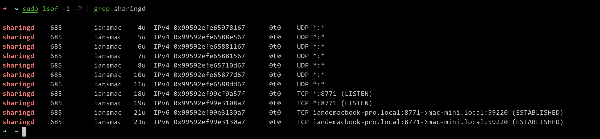

# 记录关于 Mac 的一些问题

## 问题

1. 剪切板缓存会持续从 NAS 中拷贝数据到本地并占用空间,导致本地磁盘空间不足

剪切板

`sharingd` 应该是和接力有关的服务,如果剪切板有数据,可能会触发这个服务,一直在上传数据,但是我不确定数据的流向是什么,使用 `sudo lsof -i -P | grep sharingd` 命令获得发现 
是在发送数据给另一台 Mac mini,我将 Mac mini 断网后恢复

当我在 NAS 目录中选中文件并按下 `cmd+c` 即拷贝操作时,`kernel_task` 会立即从 NAS 中获取数据, 而不是执行粘贴操作后,断开 NAS 连接网络活动会停止.
并且上述两个问题是交替出现的,

而且接力功能似乎与内网是独立的,不依靠内网传输

Mac 有一个 mDNSResponder 进程,这个进程是用来处理局域网内的服务发现的,这个进程会监听

基本上可以确认是接力导致的,在 Mac 关机状态下,不会出现上述操作网络读取的情况.

我需要像 Apple 反馈这个问题,目前最好的办法就是不要对 NAS 中的文件执行 Copy 操作
